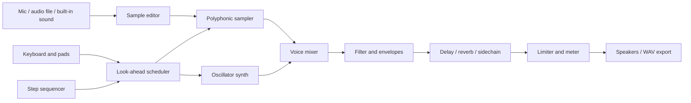

# Audio Rhythm Studio — Standalone Project Plan

## Product goal

Build a browser-based rhythm instrument where players can record a short sound, transform it into a playable instrument, perform it from a keyboard or pads, and arrange an original tropical electronic-pop loop. The sound palette should feel bright, spacious, syncopated, and festival-ready without reproducing a specific artist, song, recording, or signature preset.

## Core experience

1. Start with a built-in sound or record/import a short sample.
2. Trim the sample and choose its root note.
3. Play it chromatically from an on-screen piano or computer keyboard.
4. Shape it with filter, pitch envelope, amp envelope, reverb, delay, sidechain pulse, and a safe limiter.
5. Record a four- or eight-bar performance into a step sequencer.
6. Add drums, bass, chords, and vocal-style chops from original built-in sounds.
7. Complete a rhythm challenge or save/export the original loop.

## First release

- Installable standalone web app with responsive desktop and tablet layouts.
- Web Audio API engine using `AudioWorklet` for low-latency sample playback.
- Microphone recording and local audio-file import with explicit permission and a visible recording state.
- Waveform editor with trim, normalize, fade-in, fade-out, reverse, and root-note selection.
- Two-octave piano keyboard, velocity-sensitive pads where supported, computer-key bindings, octave shift, sustain, pitch bend, and scale lock.
- Sixteen-step sequencer with four lanes, swing, tempo, quantize, mute, solo, undo, and pattern duplication.
- Original preset families: sunlit pluck, airy vocal chop, wide supersaw, soft mallet, rubber bass, sub bass, clap, kick, hat, and percussion.
- Rhythm-game mode with listen, perform, timing score, streaks, and automatic round completion.
- Local project saving through IndexedDB and offline-capable assets through a service worker.
- WAV mix export and a compact project-file export. MIDI export can follow after the timing model is stable.

## Audio architecture

Use one audio clock for live notes, sequencer playback, scoring, and export. Schedule events slightly ahead of playback instead of relying on UI timers. Keep visual animation on `requestAnimationFrame`, driven from audio time.

## Safety and ownership

- Keep microphone recordings local unless the player explicitly exports or shares them.
- Show input level before recording and prevent clipping.
- Limit imported sample length in the first release to control memory use.
- Ship only original or properly licensed built-in samples.
- Name presets by sound characteristics rather than artists or commercial songs.

## Delivery phases

### Phase 1 — Instrument prototype

Create the audio graph, sample recorder/importer, waveform trim controls, twelve-note keyboard, ADSR envelope, filter, master meter, and limiter. Validate latency on current Chrome, Safari, Firefox, iPadOS, and Android.

### Phase 2 — Beat creation

Add the drum rack, sixteen-step sequencer, transport, tempo, swing, quantization, undo history, and IndexedDB project persistence.

### Phase 3 — Sound design

Add pitch envelopes, LFO routing, delay, reverb, sidechain pulse, scale lock, preset browsing, and the original tropical electronic-pop preset library.

### Phase 4 — Rhythm game

Add authored timing patterns, difficulty bands, live timing feedback, streak scoring, accessibility options, quiet visual play, and automatic completion after each scored round.

### Phase 5 — Export and release

Add offline WAV rendering, project import/export, installability, first-run tutorial, performance profiling, accessibility review, and automated audio/timing tests.

## Acceptance targets

- First playable sound within two seconds after user interaction.
- Live input-to-output latency below 50 ms on supported desktop hardware and below 90 ms on supported mobile hardware.
- Sequencer drift below 5 ms over a four-minute playback test.
- No audible clipping at maximum polyphony.
- Full keyboard-only operation and labeled controls.
- Projects survive reload and browser restart.
- Exported WAV matches the arranged duration and stays below 0 dBFS.

## Decisions for kickoff

- Choose React/Vite or a small framework-neutral TypeScript shell for the standalone app.
- Decide whether v1 supports microphone recording on iOS or treats file import as the mobile fallback.
- Select the first-release project limit: recommended eight tracks, eight patterns, and 30 seconds per user sample.
- Commission or create the original sample pack before preset tuning begins.
